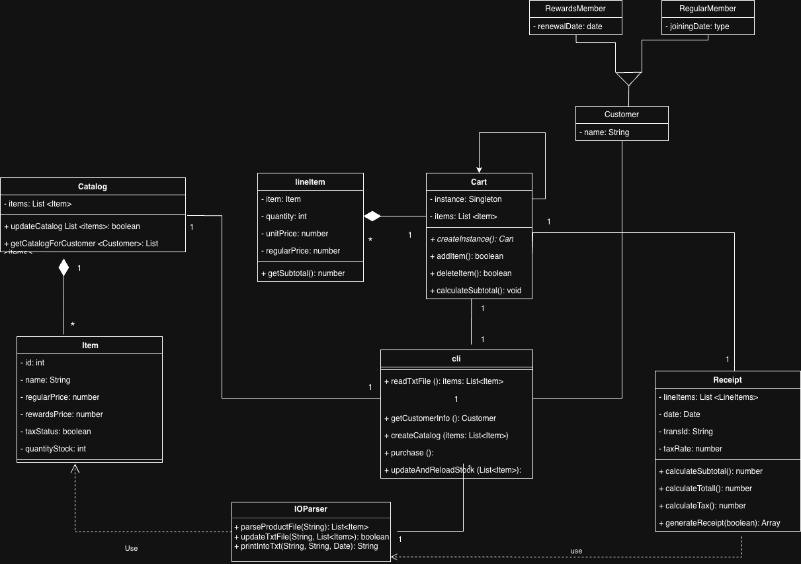

# Jerry's Quick Mart

## Table of Contents

1. [Description](#description)
2. [Class Diagram](#class-diagram)
3. [Features Implemented](#features-implemented)
   - [Core Business Logic](#core-business-logic)
   - [Web Interface](#web-interface)
   - [Command-Line Interface](#command-line-interface)
   - [Testing](#testing)
4. [Usage Modes](#usage-modes)
   - [Requirements](#requirements)
   - [Install Dependencies](#step-1--install-dependencies)
   - [Server + Browser UI](#a-server--browser-ui)
   - [Run CLI App](#b-run-cli-app)
5. [Expected Results](#-expected-results)
6. [Project Structure](#project-structure)
7. [Tests Coverage](#tests)
8. [Author](#author)

## Description

**Jerry's Quick Mart** is a small sample shopping-cart application built with **Node.js**.  
The project can be used in two different modes:

- a simple web server with a static single-page frontend and JSON API  
- an interactive command-line (CLI) shopping program  


The web server (`src/server.js`) and CLI application (`src/cli.js`) are provided as lightweight interfaces to allow easy testing and demonstration. 

---

## Class Diagram


---

## Features Implemented

### Core Business Logic
- Inventory is parsed from a plain text file: `data/inventory.txt`
- Product catalog exposed through a REST-like API
- Support for two customer types:
  - **Regular customers**
  - **Rewards members** with discounted pricing
- Tax calculation at a fixed rate of **6.5%**
- Subtotal, tax, total, change, and savings computed on the server
- Fully formatted transaction receipt generation

#### Web Interface
- Lightweight static Single Page Application located in `view/`
- Browse catalog and dynamically add/delete items to cart
- Receipt download directly in the browser
- Receipts automatically saved to disk in `receipts/`

#### Command-Line Interface
- Interactive console-based shopping flow
- Reuses the same models and IO utilities as the server
- Supports cash payment and receipt persistence
- Receipts automatically saved to disk in `receipts/`

#### Testing
- Unit and integration tests written with **Jest**
- End-to-end validation of server endpoints
- Coverage of domain models and file utilities

---

## Usage Modes

### Requirements

- Node.js (recommended **v16+**)  
- npm  
- Tested on **macOS**, but platform-independent

### Step 1 – Install Dependencies

```bash
npm install
```

### a) Server + Browser UI

Run the HTTP server and access the application through your browser for a graphical shopping experience.

```bash
node src/server.js
```
Then open in your browser:

http://localhost:3000


### b) Run CLI App
```bash
node src/cli.js
```
Use the interactive terminal program to shop entirely through console prompts.

---
## ✅ Expected Results

1. When the server or CLI starts, the program reads the file `data/inventory.txt`.
2. An specific catalog is show, according to the type of customer.
3. A shopping cart system is set up, so customer can add items, delete items, enmpty cart, add/reduce qty, purchase
4. After a succesfull purchase the  `data/inventory.txt` file is updated synchronously with new stock.
5. Every successful transaction results in the generation of: `receipts/transaction_{transId}_{DDMMYYYY}.txt`
- For Web implementation, the user can download a copy of the receipt (txt file).

---

## Project Structure 

- package.json — project manifest
- data/
  - inventory.txt — plain text inventory persisted between runs
- receipts/ — server writes transaction files here
- src/
  - server.js — lightweight HTTP server + API
  - cli.js — interactive command-line shopping flow
  - models/
    - Item.js
    - LineItem.js
    - Cart.js
    - Receipt.js
    - Catalog.js
    - Customer types (RegularCustomer, RewardsCustomer)
  - utils/
    - IOParser.js — parse and update inventory and save receipts
- view/ — static frontend (HTML/CSS/JS)
- tests/ — Jest tests (unit + integration)

---

## Tests
The project includes:

- Unit tests covering domain models and utilities

- Integration tests validating endpoints such as:
    /api/checkout
    /api/printReceipt

To run tests:
```bash
npm test
```

## Author

**Copyright (c) 2026 Xavier Andres Carpio Layedra**
All rights reserved. 


